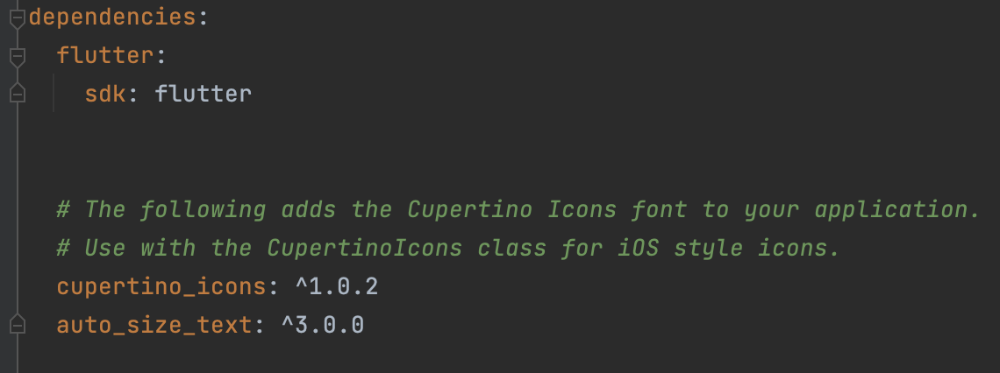
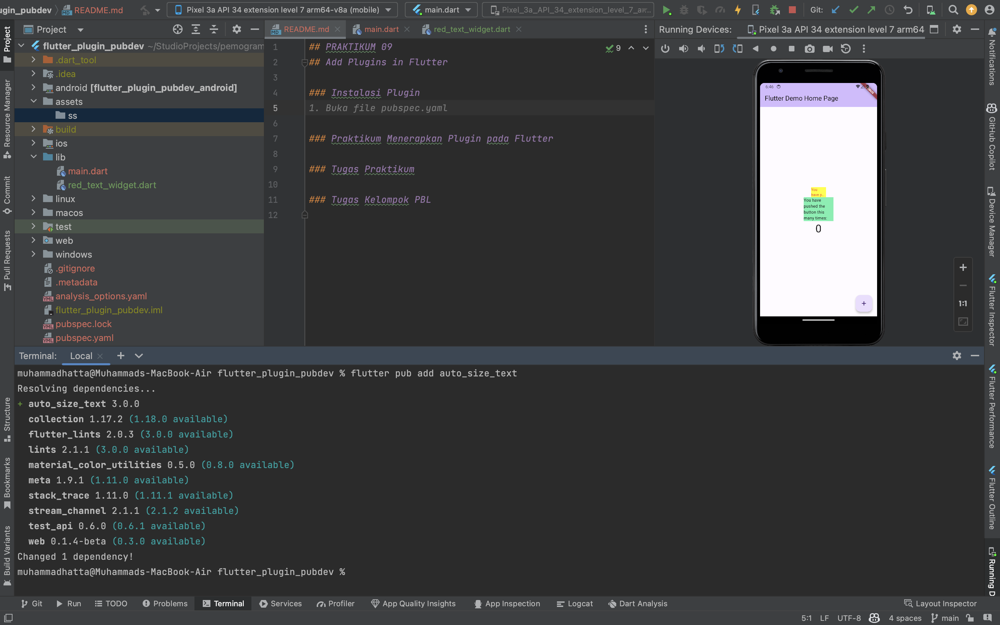
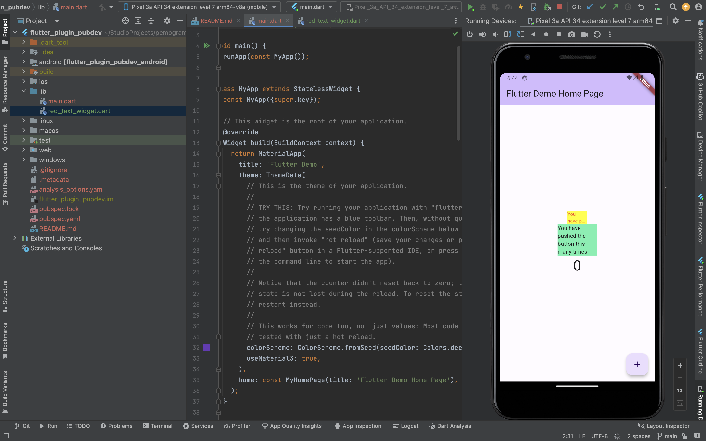

# Muhammad Hatta
# 2141720021
# Pemrograman Mobile

## PRAKTIKUM 09
## Add Plugins in Flutter

### Instalasi Plugin
#### tambahkan 'flutter pub add auto_size_text' pada terminal, pastikan berhasil. jika berhasil akan muncul seperti di file pubspec.yaml.

#### kegunaan plugin tersebut adalah untuk mengatur ukuran text sesuai dengan ukuran layar.

### Praktikum Menerapkan Plugin pada Flutter
#### langkah 5, digunakan untuk menambahkan parameter pada Widget AutoSizeText. hal tersebut digunakan untuk mengatur ukuran text sesuai dengan ukuran layar. pada saat pemanggilan widget AutoSizeText, tambahkan parameter maxLines: 2, dan overflow: TextOverflow.ellipsis.

### Hasil Praktikum
