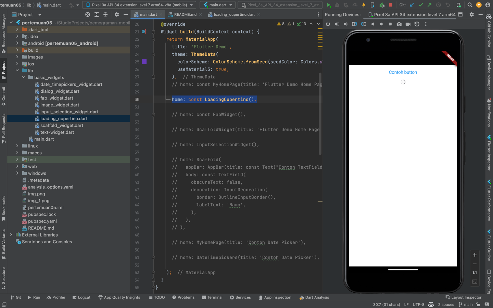
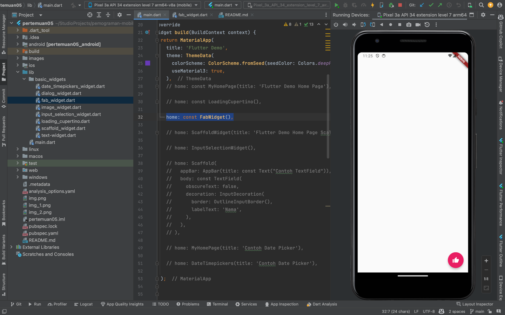

# PERTEMUAN 05

### Nama : Muhammad Hatta
### NIM : 2141720021
### Kelas : TI-3A

## Hasil Praktikum 3

### Menerapkan Widget Dasar
1. Widget Text

2. Image Widget

## Hasil Praktikum 4

### Menerapkan Widget Material Design dan iOS Cupertino
1. Cupertino Button dan Loading Bar

2. Floating Action Button (FAB)

3. Scaffold Widget

4. Dialog Widget

5. Input dan Selection Widget

6. Date and Time Pickers

## Hasil Tugas Memisahkan Masing-masing widget

